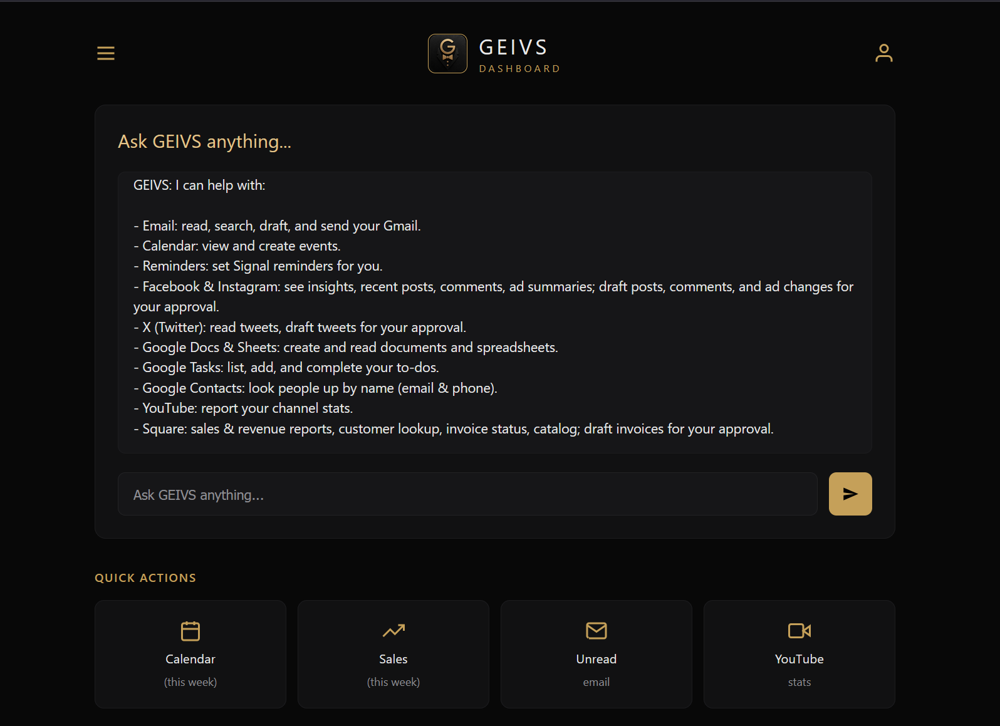

# GEIVS Pro

<p align="center"></p>

**General Encrypted Intelligent Valet Software — Pro Edition**

A fully self-hosted AI platform for small businesses. Private, local, no subscriptions, no cloud dependency.

---

## What is GEIVS?

GEIVS gives your business a private AI assistant that runs entirely on your own hardware. It combines a capable local language model with a full suite of integrated services — email, messaging, calendar, social media, image generation, web search, and more — all managed through a single conversational interface.

The assistant's name and personality are set during installation. Your data stays on your machine. Always.

---

## Requirements

| | Minimum | Recommended |
|---|---|---|
| OS | Ubuntu 22.04 LTS | Ubuntu 24.04 LTS |
| GPU | NVIDIA 8GB VRAM | NVIDIA 24GB VRAM (RTX 4090) |
| RAM | 16GB | 32GB+ |
| Storage | 100GB free | 240GB+ free |

> No GPU? See [CPU / VM Mode](#cpu--vm-mode) below.

All software dependencies (Docker, NVIDIA drivers, Container Toolkit, etc.) are installed automatically by `geivs-prep.sh`.

---

## Installation

Two scripts, run in order. Both are idempotent — safe to re-run.

### Step 1 — Prepare and harden the server

Run as root on a **fresh Ubuntu install**. Installs NVIDIA drivers, Docker, NVIDIA Container Toolkit, UFW firewall, fail2ban, swap, and kernel tuning.

```bash
curl -fsSL https://raw.githubusercontent.com/an0ndroid/GEIVS/main/geivs-prep.sh | sudo bash
```

If NVIDIA drivers were newly installed, reboot before continuing:

```bash
sudo reboot
```

### Step 2 — Install GEIVS

Run as your normal user (not root). Downloads the stack, generates all secrets, starts all services, imports n8n workflows, and walks you through connecting email, Signal, Google Calendar, and social media.

```bash
curl -fsSL https://raw.githubusercontent.com/an0ndroid/GEIVS/main/geivs-install.sh | bash
```

The installer will prompt for your business name, assistant persona name, and preferred AI model. Once complete, open `http://your-server-ip` to start.

> ⏱ First install takes 60–90 minutes — most of that is downloading Docker images (15+ GB). Leave it running.

---

## What Each Script Does

### geivs-prep.sh

| Step | Action |
|------|--------|
| System update | Full apt upgrade |
| Prerequisites | curl, git, python3, jq, htop, chrony, build-essential, and more |
| Timezone & NTP | Sets timezone, enables chrony (accurate time for automation workflows) |
| NVIDIA drivers | Auto-detects and installs recommended driver |
| Docker Engine | Official Docker install |
| NVIDIA Container Toolkit | Installs toolkit, sets nvidia as Docker default runtime |
| Swap | Creates 32GB swap file (configurable) for model memory overflow |
| Kernel tuning | SYN flood protection, inotify limits, TCP buffers, vm.swappiness=10 |
| System limits | 1M file handles, 64K processes for Docker/Ollama/n8n |
| SSH hardening | Disables root login, tightens auth timeouts |
| UFW firewall | Allows 22/tcp, 80/tcp, 443/tcp, 41641/udp (Tailscale) |
| fail2ban | 4 failed SSH attempts = 2h ban |
| Auto security updates | Unattended security patches, no auto-reboot |

### geivs-install.sh

| Step | Action |
|------|--------|
| GPU detection | Identifies NVIDIA / AMD / CPU-only and configures accordingly |
| Configuration | Prompts for hostname, admin email/password, business name, persona name, AI model |
| Secrets | Generates all keys (n8n encryption, JWT, AnythingLLM, API key, etc.) |
| .env | Writes fully populated environment file (chmod 600) |
| Compose file | Downloads and patches docker-compose.pro.yml |
| nginx config | Downloads reverse proxy config |
| Workflows | Downloads all 13 n8n automation workflows |
| Support files | Downloads onboarding script, system prompt, model pull scripts |
| Stack start | `docker compose up -d` |
| SearXNG patch | Enables JSON format required for agent web search |
| Onboarding | Seeds the state file and starts model downloads |
| Model download | Pulls primary AI model in background |
| Workflow import | Imports all n8n workflows via API |
| Tailscale | Configures remote access (if key provided) |
| Email setup | Collects IMAP/SMTP credentials, creates n8n credentials, activates email workflows |
| Signal setup | Registers phone number, verifies SMS code, activates Signal workflows |
| Google Calendar | Guided OAuth setup instructions (browser-based) |
| Social media | Guided Postiz account setup |
| Summary | Prints all URLs, credentials, and integration status |

---

## Access URLs

All services route through nginx on port 80.

| URL | Service |
|-----|---------|
| `http://your-ip/` | GEIVS Dashboard — your AI assistant's web face (chat + quick actions) |
| `http://your-ip/automation/` | n8n workflow automation |
| `http://your-ip/monitor/` | Uptime Kuma monitoring |
| `http://your-ip/imagine/` | ComfyUI image generation |
| `http://your-ip/search/` | SearXNG private search |
| `http://your-ip/social/` | Postiz social media scheduler |
| `http://your-ip/portainer/` | Portainer container management |
| `http://your-ip/knowledge` → `:3001` | AnythingLLM — knowledge base (RAG) + admin LLM (redirects to its own port) |

---

## Services

| Container | Purpose |
|-----------|---------|
| ollama | Local LLM inference |
| anythingllm | Knowledge base (RAG) + admin LLM |
| n8n | Automation workflows |
| comfyui | Stable Diffusion image generation |
| piper | Text-to-speech |
| faster-whisper | Speech-to-text transcription |
| searxng | Self-hosted web search |
| qdrant | Vector database for memory |
| signal-cli | Signal messenger integration |
| postiz | Social media scheduling |
| crawl4ai | Web scraping for AI research |
| uptime-kuma | Service health monitoring |
| portainer | Container management UI |
| nginx | Reverse proxy |

---

## n8n Workflows

| Workflow | Function |
|----------|---------|
| geivs-email-bot | Reads and replies to email via your AI assistant |
| geivs-signal-bot | Sends and receives Signal messages |
| geivs-daily-briefing | Morning summary: weather, calendar, email digest |
| geivs-email-draft | Drafts email responses for review |
| geivs-calendar-integration | Google Calendar read/write |
| geivs-dashboard | Status overview |
| geivs-email-transcription | Transcribes voice email attachments |
| geivs-signal-transcription | Transcribes Signal voice messages |
| geivs-email-setup | Email credential setup helper |
| geivs-signal-setup | Signal registration helper |
| geivs-calendar-setup | Calendar OAuth setup helper |
| geivs-storage-setup | Storage configuration helper |
| geivs-telegram-setup | Telegram bot setup helper |

---

## GEIVS Assistant Layer (n8n-workflows/geivs-assistant/)

A conversational agent layer on top of the base install. Two front doors — Signal chat and a web chat endpoint — both drive the same tool-using agent over your local model, so the assistant can take actions during a conversation instead of just answering questions.

**Agent front doors**

| Workflow | Function |
|----------|---------|
| geivs-agent-signal | Signal-facing conversational agent (LangChain agent + tool router) |
| geivs-agent-http | Same agent exposed over a webhook for web/embedded chat front-ends |

**Domain tools** — each is a self-contained dispatcher the agent calls with an `action` argument, so adding a capability to a domain doesn't add a new tool slot to the agent's context:

| Workflow | Domain | Example actions |
|----------|--------|-----------------|
| geivs-domain-email | Email | search, read, draft, send |
| geivs-domain-calendar | Calendar | get events, create event |
| geivs-domain-meta | Facebook / Instagram | insights, recent posts, read comments, ads summary, draft post/reply (approve-before-publish) |
| geivs-domain-social-x | X (Twitter) | read, draft post, list/publish drafts (approve-before-publish) |
| geivs-domain-google-docs | Google Docs | create, read |
| geivs-domain-google-sheets | Google Sheets | create, read |
| geivs-domain-google-tasks | Google Tasks | list, add, complete |
| geivs-domain-square | Square (payments/POS) | sales summary, customer lookup, catalog lookup, draft invoice (approve-before-send) — **read-only + draft; no refund/charge/send tooling** |

**Standalone tools & backends**

| Workflow | Function |
|----------|---------|
| geivs-tool-reminder-set | Lets the agent schedule a reminder mid-conversation |
| geivs-tool-contact-lookup | Google Contacts lookup |
| geivs-tool-youtube-stats | Channel stats lookup (read-only) |
| geivs-tool-cal-get | Reads calendar events for a given time range — called by `geivs-domain-calendar` and by the Dashboard API below |
| geivs-tool-square-sales | Reads Square payments for a period (today/week/month) and returns a summary + daily breakdown — called by `geivs-domain-square` and the Dashboard API |
| geivs-tool-gmail-search | Searches Gmail and returns a compact summary — called by `geivs-domain-email` and the Dashboard API |
| geivs-reminder-add / geivs-reminder-fire | Reminder queue + per-minute firing check |
| geivs-morning-briefing | Scheduled daily summary (calendar + unread email) delivered to Signal |
| geivs-bootstrap-data-table | One-time setup of the n8n data table the reminder queue uses |
| geivs-backend-gmail / geivs-backend-calendar / geivs-backend-meta / geivs-backend-x / geivs-backend-square | Internal webhooks the domain tools call — keeps service-account/API auth off the agent's direct tool path |

### GEIVS Dashboard (dashboard/ + geivs-dashboard-api)

A quick-access GUI that sits alongside the chat interface: a chat box (talks to `geivs-agent-http`, same as the web chat above) plus a row of buttons that skip the LLM entirely for deterministic lookups — no tool-call reasoning, no wait, just a direct backend read. Useful for anything you'd otherwise have to ask GEIVS in words every time.



- **`geivs-dashboard-api`** (n8n-workflows/geivs-assistant/) — a thin gateway workflow. One webhook (`/webhook/geivs-dashboard`), takes `{"action": "..."}`, routes via a Switch node to the matching tool workflow above, and returns its result untouched. No LLM call in this path.
- **`dashboard/`** (repo root) — the static front-end: `index.html` (vanilla HTML/JS/CSS, no build step, no external dependencies) and `geivs-logo.png`. Served by the existing nginx container at `/dashboard/`, proxying `/dashboard/api/dashboard` and `/dashboard/api/chat/` to n8n internally — already wired into both `docker-compose.pro.yml` and `docker-compose.cpu.yml`, no extra services to run.
- **Default buttons**: calendar (this week, rendered as a day-by-day agenda), sales (this week, with a small bar chart), unread email count, YouTube channel stats.

**Customizing per client** — this is the intended per-install customization point. Open `dashboard/index.html` and edit the `BUTTONS` array near the top of the `<script>` block:

```js
const BUTTONS = [
  { action: 'calendar', label: 'Calendar (this week)' },
  { action: 'sales', label: 'Sales (this week)' },
  // add, remove, or relabel entries here
];
```

Each `action` must have a matching branch in `geivs-dashboard-api`'s Switch node (add one there first if you're wiring up a new lookup, following the existing branches as a template). The buttons and their result cards are generated from this list — no other HTML/JS needs editing to add or remove a button.

**Setup notes**

- Requires credentials created in your own n8n instance: Gmail (OAuth2), a Google service account or OAuth client for Calendar, a Google multi-scope OAuth client for Docs/Sheets/Tasks/Contacts/YouTube, a Facebook Graph System User token, an X OAuth 1.0a app, and a Square access token. None of these are bundled — the workflows reference credentials by name, so create matching ones after import and n8n will prompt you to reassign them.
- Several workflows carry `{{PLACEHOLDER}}` values (`{{FACEBOOK_PAGE_ID}}`, `{{INSTAGRAM_BUSINESS_ID}}`, `{{META_AD_ACCOUNT_ID}}`, `{{SQUARE_LOCATION_ID}}`, `{{OWNER_CALENDAR_EMAIL}}`, `{{OWNER_CALENDAR_EMAIL_URLENC}}`, `{{X_ACCOUNT_ID}}`, `{{X_HANDLE}}`, `{{INSTAGRAM_HANDLE}}`, `{{GEIVS_SIGNAL_NUMBER}}`, `{{OWNER_SIGNAL_NUMBER}}`) — replace these with your own business's values before activating.
- Anything that posts publicly or spends money (social posts, ad changes, invoices) is **draft-then-approve**: the agent creates a draft and only publishes/sends on an explicit follow-up confirmation.
- This layer is new and was validated against a single reference deployment — treat it as a starting template, not a hardened multi-tenant product yet.

---

## Models

| Model | Size | Best for |
|-------|------|---------|
| llama3.3:70b | ~42GB | Best quality (GPU required) |
| gemma3:12b | ~8GB | Balanced quality and speed |
| qwen2.5:7b | ~4.7GB | Fast, efficient, good reasoning |
| gemma3:4b | ~3GB | CPU mode / low RAM systems |
| gemma4:26b | ~18GB | MoE (only ~3.8B active params/token) — strong tool calling, good CPU t/s despite its size; needs ~20GB RAM headroom |
| gpt-oss:20b | ~13GB | MoE, strong agentic tool calling; needs ~16GB+ RAM headroom |

The last two are opt-in for CPU-only installs with 32GB+ system RAM (select them by number when the installer prompts for a model) — they're not the CPU-mode default since that still targets 16GB-minimum boxes, but on a box with headroom their MoE architecture gets meaningfully better tool-calling quality per token of CPU compute than an equivalent-speed dense model like qwen2.5:7b.

The installer prompts you to choose. Ollama handles quantization automatically.

---

## Integrations

| Integration | Provider |
|-------------|---------|
| Email | Gmail, Outlook, any IMAP/SMTP |
| Messaging | Signal, Telegram, Discord |
| Calendar | Google Calendar |
| Social Media | Twitter/X, LinkedIn, Facebook, Instagram (via Postiz) |
| Image Generation | Stable Diffusion via ComfyUI (local, no API key needed) |
| Speech-to-Text | faster-whisper (local, no API key needed) |
| Web Search | SearXNG (local, private) |

---

## File Structure

```
GEIVS/
├── geivs-prep.sh               # Step 1: server hardening and prerequisites
├── geivs-install.sh            # Step 2: full GEIVS stack installer
├── docker-compose.pro.yml      # GPU stack definition
├── docker-compose.cpu.yml      # CPU-only stack definition
├── update-geivs.sh             # Update all images and models
├── geivs-gateway-setup.sh      # Fetches + starts the containerized gateway (bridge/shim/render/email)
├── onboarding-init.sh          # First-boot: seeds state file + starts model downloads
├── geivs-state.json            # Default assistant state template
├── geivs-system-prompt.md      # Default assistant persona and instructions
├── pull-models.sh              # GPU model download script
├── pull-models-cpu.sh          # CPU model download script
├── nginx/
│   └── geivs.conf              # Nginx reverse proxy configuration
├── dashboard/                   # optional quick-access GUI, see GEIVS Assistant Layer below
│   ├── index.html               # customize the BUTTONS list here per client
│   └── geivs-logo.png
└── n8n-workflows/
    ├── geivs-email-bot.json
    ├── geivs-signal-bot.json
    ├── geivs-daily-briefing.json
    ├── geivs-email-draft.json
    ├── geivs-calendar-integration.json
    ├── geivs-dashboard.json
    ├── geivs-email-transcription.json
    ├── geivs-signal-transcription.json
    ├── geivs-email-setup.json
    ├── geivs-signal-setup.json
    ├── geivs-calendar-setup.json
    ├── geivs-storage-setup.json
    ├── geivs-telegram-setup.json
    └── geivs-assistant/            # optional conversational agent layer, see below
        ├── geivs-agent-signal.json
        ├── geivs-agent-http.json
        ├── geivs-domain-email.json
        ├── geivs-domain-calendar.json
        ├── geivs-domain-meta.json
        ├── geivs-domain-social-x.json
        ├── geivs-domain-google-docs.json
        ├── geivs-domain-google-sheets.json
        ├── geivs-domain-google-tasks.json
        ├── geivs-domain-square.json
        ├── geivs-tool-reminder-set.json
        ├── geivs-tool-contact-lookup.json
        ├── geivs-tool-youtube-stats.json
        ├── geivs-tool-cal-get.json
        ├── geivs-tool-square-sales.json
        ├── geivs-tool-gmail-search.json
        ├── geivs-reminder-add.json
        ├── geivs-reminder-fire.json
        ├── geivs-morning-briefing.json
        ├── geivs-bootstrap-data-table.json
        ├── geivs-backend-gmail.json
        ├── geivs-backend-calendar.json
        ├── geivs-backend-meta.json
        ├── geivs-backend-x.json
        ├── geivs-backend-square.json
        └── geivs-dashboard-api.json
```

---

## Updating GEIVS

```bash
cd ~/geivs && bash update-geivs.sh
```

Pulls latest Docker images and refreshes Ollama models.

---

## CPU / VM Mode

No NVIDIA GPU? The installer detects this automatically and configures the CPU stack.

| | GPU (Pro) | CPU |
|---|---|---|
| GPU required | Yes | No |
| Default model | llama3.3:70b | qwen2.5:7b |
| ComfyUI image | latest-cuda | latest-cpu |
| Whisper mode | cuda / medium | cpu / tiny |
| Recommended RAM | 32GB | 16GB minimum |

---

## VM Notes

If running in a VM, LVM may not use all available disk by default. Expand it:

```bash
sudo lvextend -l +100%FREE /dev/mapper/ubuntu--vg-ubuntu--lv
sudo resize2fs /dev/mapper/ubuntu--vg-ubuntu--lv
df -h
```

GPU passthrough is not available in most VM configurations — use the CPU stack.

---

## Troubleshooting

**GPU not detected after install:**
```bash
nvidia-smi          # verify driver is loaded — if this fails, reboot
```

**SearXNG not returning JSON (breaks agent web search):**
```bash
docker exec geivs_searxng grep -A5 'formats:' /etc/searxng/settings.yml
# should show both: - html and - json
```

**n8n workflows not imported:**
```bash
for f in ~/geivs/n8n-workflows/*.json; do
  docker cp "$f" geivs_n8n:/tmp/
done
docker exec geivs_n8n n8n import:workflow --separate --input=/tmp/
```

**View any container's logs:**
```bash
docker logs geivs_<service> --tail 50 -f
```

**Out of disk space:**
```bash
df -h
docker system prune -f
```

---

## License

MIT

---

*GEIVS Pro — Your data. Your hardware. Your terms.*
